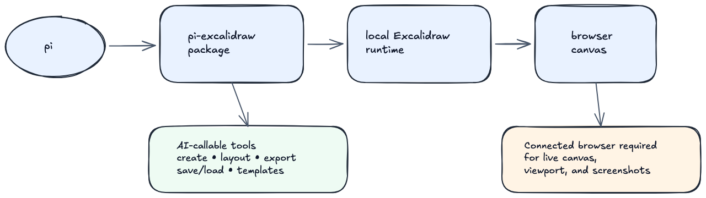

# pi-excalidraw

`pi-excalidraw` gives [pi](https://github.com/mariozechner/pi) a locally hosted Excalidraw canvas plus AI-callable tools for drawing, layout, screenshots, persistence, templates, and mixed-diagram composition.

It is built for a practical local loop: pi starts the Excalidraw runtime, you keep the canvas open in a browser, and the model uses tool calls plus screenshots to create and refine diagrams on that live whiteboard.

> [!IMPORTANT]
> `pi-excalidraw` is a local, browser-connected workflow. Canvas interaction, viewport control, screenshot capture, and image export require a connected browser tab or pane. This package does **not** provide a hosted Excalidraw service or a fully headless drawing runtime.



## What ships today

The published package includes these validated capabilities:

- Start and manage a local Excalidraw canvas from pi
- Create, inspect, update, delete, clear, export, and screenshot canvas elements
- Generate higher-level diagram structures with nodes, connected flows, titled panels, and wrapper helpers
- Apply deterministic layout polish with `horizontal`, `vertical`, and `centered-flow` modes
- Save and reload project-local diagrams under `.pi/excalidraw-diagrams/`
- Save and apply reusable templates under `.pi/excalidraw-templates/`
- Use improved sizing, spacing, composition helpers, and final layout polish from the shipped Phase 10–12 work

Not shipped yet:

- Mermaid conversion
- Hosted/cloud canvas workflows
- A separate collaboration backend beyond the local Excalidraw canvas flow

## Installation

### Install from npm

Install the package into the project where you run pi:

```bash
npm install pi-excalidraw
```

Then start pi in that project. If pi is already running, use `/reload` so it re-discovers installed packages and extensions.

### Install from git

```bash
pi install git:github.com/coctostan/pi-excalidraw
```

### Install from a local checkout

```bash
pi install /absolute/path/to/pi-excalidraw
```

### Requirements

- Node.js `>=20`
- A local browser you can keep connected to the reported Excalidraw URL

## Quick start

1. Start pi in the project where `pi-excalidraw` is installed.
2. Run `/excalidraw` to start the local Excalidraw runtime.
3. Open the reported URL in a browser and keep that canvas connected.
4. Ask pi to create or modify a diagram.
5. Use focus and screenshot steps to visually validate the result.

Example requests:

- “Open Excalidraw and sketch a simple system diagram.”
- “Create three connected nodes for API → worker → database, then lay them out horizontally.”
- “Wrap these nodes in a titled panel called Ingestion Pipeline.”
- “Save this as a reusable template called architecture-review.”
- “Focus the canvas, capture a screenshot, and tell me if the labels are readable.”

## Usage

### Common workflow

A typical session looks like this:

1. Open the live canvas with `/excalidraw`
2. Ask pi to create or modify diagram content
3. Ask pi to polish layout
4. Ask pi to focus the canvas and capture a screenshot
5. Iterate until the diagram looks right
6. Save the result as a diagram or template if you want to resume later

### High-level helpers

The package exposes higher-level tool workflows for:

- polished single nodes and labeled boxes
- connected-node diagrams
- titled composition panels
- wrapping existing content in titled panels
- deterministic diagram layout and polish
- viewport focusing and screenshot capture
- diagram save/list/load
- template save/list/apply

### Persistence workflow

For project-specific work, save the current scene as a diagram bundle and reload it later:

- diagrams are stored under `.pi/excalidraw-diagrams/`
- templates are stored under `.pi/excalidraw-templates/`

This keeps Excalidraw work resumable across sessions without adding remote persistence infrastructure.

## Current package structure

This repository uses the repo root as the canonical pi package entrypoint:

```text
src/index.ts                          # canonical extension entrypoint declared in package.json
.pi/extensions/pi-excalidraw/index.ts # thin local development shim for /reload while working in this repo
vendor/mcp_excalidraw/                # vendored Excalidraw runtime used by the local server workflow
scripts/smoke-test.mjs                # package smoke test
assets/readme/                        # package/readme graphics
```

## Validation

From the repository root:

```bash
npm install
npm run check
```

`npm run check` runs:

- `npm run typecheck`
- `npm run smoke-test`
- `npm pack --dry-run`

## Local development with `/reload`

If you are developing inside this repository, you usually do **not** need to reinstall the package after every edit.

1. Open pi with this repository as the current project.
2. Edit `src/index.ts` or related files.
3. Run `/reload`.

Why that works:

- pi discovers `.pi/extensions/pi-excalidraw/index.ts` in this repository
- that shim re-exports the canonical implementation from `src/index.ts`
- `/reload` refreshes the extension in the current project session

## Runtime constraints and design notes

### Connected browser required

The live Excalidraw frontend must be open in a browser for the canvas to exist. Screenshot, viewport, and export workflows depend on that connected client.

### Vendored runtime by design

The repository vendors the Excalidraw runtime under `vendor/mcp_excalidraw/` because the published upstream package did not ship the runnable frontend/runtime assets needed for this extension's local server workflow.

### Scope stays intentionally tight

`pi-excalidraw` is focused on reliable local diagramming workflows for pi. It does not currently try to be a hosted service, a generic docs site, or a Mermaid conversion layer.

## Repository and support

- Repository: `https://github.com/coctostan/pi-excalidraw`
- Homepage: `https://github.com/coctostan/pi-excalidraw#readme`
- Issues: `https://github.com/coctostan/pi-excalidraw/issues`

If you want to inspect the package before installing, start with `src/index.ts`, `package.json`, and the vendored runtime layout under `vendor/mcp_excalidraw/`.
